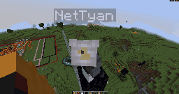
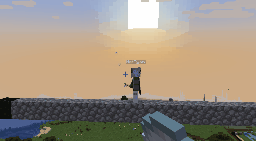
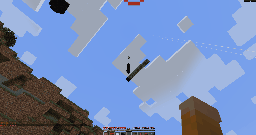
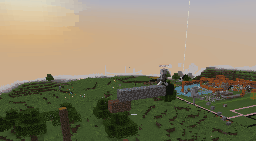

# UnionClef

Letting agents loose in block game.


An open platform for building AI agents that play Minecraft — pathfinding, combat, survival, multiplayer. The goal is to make it easy for researchers, developers, and tinkerers to plug their agents into the game and see what happens.


Originally merged from **altoclef**, **shredder**, and **tungsten** into a single codebase. As of
the "G-0" migration (2026-08-24), **tungsten is the only compiled pathfinder** — shredder and
baritone stay in the tree as source reference only, not built, not run. No submodules, no
pre-built JARs, no tears.

## Why tungsten

All the pathfinding now lives in **tungsten**; baritone and shredder stay in the tree only to read
from. The reason, in the maintainer's words:

> "It is easier to develop. Baritone has grown barnacles: it was written by seasoned mega-hackers,
> and its code is readable only by superhumans. The future belongs to the young — long live
> tungsten!"

Practically: tungsten plans on a real physics simulation of the player, so parkour, knockback and
water are part of the plan rather than special cases, and a change to it is a change to one engine,
not to a stack of engines handing the body to each other. What baritone got right (hazards, falls,
mining costs, placement rules) is not thrown away: it is ported into tungsten, with the source line
it came from cited next to the port.

## What's inside

| Module | What it does |
|--------|-------------|
| **altoclef** (root) | Autonomous bot — speedruns, PvP, SkyWars, Python scripting via Py4J |
| **tungsten/** | A\* pathfinder — the only pathfinding engine actually compiled and run. Movement, parkour, block break/place, combat |
| ~~shredder/~~ | Fork of baritone with WindMouse camera + tungsten bridge. **Not compiled** — kept as source reference for the parts not yet ported into tungsten |
| ~~baritone/~~ | Original pathfinding code. **Not compiled** — kept as reference |

**Minecraft 1.21.x** (release builds for 1.21.11) / **Fabric** / **Java 21**

> **[How to build & run →](docs/DEVELOP.md)** | **[How to release →](docs/RELEASE.md)** | **[Multi-version →](docs/MULTIVERSIONING.md)** | **[Python scripting →](docs/SCRIPTS.md)**

## Features


| Feature | Description | Ready |
|---|---|---|
| **MLG** |
| Enderpearl clutch  | TP with enderpearl when pursue target. Save self with enderpearl when dropped from edge. | 3/3 ✅ |
| Arrow dodger  | Sidesteps incoming arrows: each tick it simulates the possible steps with tungsten's physics and takes the one that clears the arrow without walking into lava, fluid or a drop. Raises a shield if it has one. On by default (`dodgeProjectiles`). | 3/3 ✅ |
| `@test mace`  | Mace landing from a height | 1/1 ✅ |
| `;bridge [n \| x y z]`  | Godbridging with tungsten: forward for n blocks or towards a position. Needs a block in the hand. (The gif is from the shredder days; the old `#bridgingMode` command went with it.) | 3/3 ✅ |
| **PvP** |
| Attacking bot `@punk` | Handles close target battle. [Wind-mouse](https://github.com/arevi/wind-mouse) based rotations. Brokes shields (axe). Uses own shield. Combines ranging and melee attacks automatically, pursues targets. Using mace from the height | 3/3 ✅ |
| Shooting bot `@shoot` | Handles ranged target battle with 2 types of angle (rapid-fire, sniper, artillery) | 3/3 ✅ |
| Pursuing bot | Pursue parkouring targets. Slow for now. | 2/3 ⚠️ |
| **Survival** |
| Beat the game `@gamer` | Full playthrough from an empty inventory: wood, stone and iron tools (about 8 minutes), food, a bed from sheep or a dug-in shelter at night, then the nether. Without a diamond pickaxe it builds the portal from buckets and a lava lake. Gets to the nether; the End is not reached yet. | 2/5 ⚠️ |
| Night shelter | No bed at night on the surface: digs a 1x1 hole, caps it, waits for the morning. `;settings survival night_shelter 0` turns it off. | 3/3 ✅ |
| Bucket nether portal | Casts the 10 frame blocks with water and lava around a cobblestone mould, lights it and walks in. Lit in about 5 runs of 9 on the test course. | 2/3 ⚠️ |
| **Minigames** |
| Skywars `@game sw` | SkyWars (fails exploration, buggy) | 3/5 ⚠️ |
| Skywars `@game bw` | BedWars (only bed protect) | 3/5 ⚠️ |
| Skywars `@game skypvp` | SkyPvP (on one server, but non-redactable spawn) | 4/5 ✅ |
| Skywars `@game mm` | MurderMystery | 5/5 ✅ |
| **Building** |
| `@grave <text>`, `@sign <text>` | New structures to build | 2/2 ✅ |
| Privated regions support | Temporal block placement and removal locks | 4/5 ✅ |
| WorldEdit-style building `@@` | `@@pos1`/`@@pos2` selection, `@@set`, `@@replace`, `@@walls`, `@@hollow`, `@@cyl`, `@@sphere`, `@@copy`/`@@paste`, `@@undo`. The bot walks, pillars and places every block itself. Bulk fills can leave cells unplaced. | 2/3 ⚠️ |
| `@@schem load <name>` | Loading schematic files. The reader went away with the legacy module (G-0); needs a native .schem/.litematic reader. | 0/3 ❌ TODO |
| **Multiplayer** |
| Autologin (`@set multiplayer_password <password>`) | Autologin and autoregister | 3/3 ✅ |
| **Agentic** |
| Python integration | Py4J configurable two-way interface. Port configures via `@set pythonGatewayPort <port>`. Supports multi-instance launching. Rich contextual and method base (see `adris.altoclef.Py4JEntryPoint` class) for agents, including live-screenshot support. | 3/3 ✅ |
| Agentic commands | `@check_block`, `@check_player` | 3/3 ✅ |
| Agentic MCP server | The mod hosts an MCP server (HTTP, port 25350): 60 tools for perception, movement, combat, building and menus. Any MCP client (Claude Code, Claude Desktop, your own agent) can drive the bot. See [Connect your agent](#connect-your-agent-mcp). | 3/3 ✅ |
| **Comfort** |
| Command suggestions | Rich chat commands suggestions `@help` | 1/1 ✅ |
| Monorepo structure | Multi-versioned structured mono-repo with easy-to-work with any of integrated mod | 1/1 ✅ |

> Vote for the new features, report for bugs in the [issues](https://github.com/3ndetz/unionclef/issues).

## Quick start

1. Drop the latest JAR from [releases](https://github.com/3ndetz/unionclef/releases) into your Minecraft `mods/` folder and launch with Fabric

    > Ensure you have the correct Minecraft version for the release you download

2. Type `@help` in chat for the list of commands

## Connect your agent (MCP)

The mod runs an MCP server inside the game client, so an AI agent can see the world and drive the
bot through tools: `getGameState`, `getBlocksAround`, `gotoXYZ`, `bridgeTo`, `mineBlock`,
`punk`, `shootArrowAt`, `fillSelection`, `buildBlocks`, `clickMenuByName`, `ExecuteCommand` and
about fifty more. Every tool carries a description of what it does and when to call it.

1. **Start the game with the mod.** The server starts with it and writes a line to the log:
   `MCP server started on 0.0.0.0:25350`. It listens on every interface, so an agent on another
   machine in your LAN can reach it.
2. **Take the token.** On first start the mod generates a secret and saves it in
   `<game dir>/altoclef/altoclef_settings.json` as `mcpAuthToken`. Every request must carry it as
   `Authorization: Bearer <token>`. The port is `mcpPort` in the same file; `mcpEnabled` turns
   the server off.
3. **Add the server to your agent.**

   Claude Code:
   ```bash
   claude mcp add --transport http unionclef http://<game-machine-ip>:25350/mcp \
     --header "Authorization: Bearer <token>"
   ```
   Any client that reads `.mcp.json` (Claude Desktop, Cursor, your own):
   ```json
   { "mcpServers": { "unionclef": {
       "type": "http",
       "url": "http://<game-machine-ip>:25350/mcp",
       "headers": { "Authorization": "Bearer <token>" } } } }
   ```
4. **Check it.**
   ```bash
   curl -s http://127.0.0.1:25350/mcp -H "Authorization: Bearer <token>" \
     -H 'Content-Type: application/json' -d '{"jsonrpc":"2.0","id":1,"method":"tools/list"}'
   ```
   Then ask the agent to call `getGameState`: it returns position, health, food, inventory,
   nearby players and what the bot is looking at.

The same levers are available from Python over Py4J (port 25333). Details:
[docs/features/MCP_SERVER.md](docs/features/MCP_SERVER.md) and
[docs/features/AGENT_PY4J_LEVERS.md](docs/features/AGENT_PY4J_LEVERS.md).

## Development

Quick start for development — clone the repo, build, and run:

```bash
git clone https://github.com/3ndetz/unionclef
cd unionclef
gradlew compileJava     # compiles everything
gradlew runClient       # launches Minecraft
```

See **[docs/DEVELOP.md](docs/DEVELOP.md)** for debug setup, hot-swap, and troubleshooting.

## Demo

<details><summary>SkyWars bot in action</summary>

### Looting chests


### Gapple & EnderPearl


### Kill & Loot


### Bow


</details>

<details><summary>Tungsten pathfinding</summary>

Pathfinder that can't build/break blocks and looks like a NASA computing program.


</details>

## Project structure

```
unionclef/
├── src/main/java/          altoclef source (bot logic, commands, tasks)
├── src/main/resources/     fabric.mod.json, mixins, assets
├── tungsten/               tungsten source (A* movement) — the ONLY compiled pathfinder
│   └── src/main/java/      tungsten code
├── shredder/               NOT COMPILED — source reference only (see G-0 in TODOS.md)
│   └── src/main/java/      shredder code (baritone.* packages)
├── baritone/               NOT COMPILED — source reference only (see G-0 in TODOS.md)
│   └── src/main/java/      original baritone code (remapped to yarn)
├── scripts/                python scripting via Py4J (uv project)
├── root.gradle.kts         root build config
├── gradle.properties       versions & settings
├── deploy/                 docker test bench and course runner
├── reports/                video report builder (HyperFrames)
├── docs/                   build, release, features, checklists
├── README.md               you are here
└── TODOS.md                project TODOs and roadmap
```

## Fork History

### altoclef

1. Origin: **[gaucho-matrero/altoclef](https://github.com/gaucho-matrero/altoclef)** →
2. Fork: **[MarvionKirito/altoclef](https://github.com/MarvionKirito/altoclef)** →
3. Fork: **[MiranCZ/altoclef](https://github.com/MiranCZ/altoclef)** (multi-version support, bug fixes) →
4. Fork: **[3ndetz/autoclef](https://github.com/3ndetz/autoclef)** (multiplayer, SkyWars, Python bridge) →
5. Merged into: **unionclef**

### shredder (retired)

Fork of baritone, once rebuilt as the primary pathfinder: kept `baritone.*` packages for API
compatibility and added WindMouse camera smoothing, human-like movement entropy, and a tungsten
bridge that delegated complex parkour segments to tungsten's A\* executor. Retired from the build
by the "G-0" migration (2026-08-24) once tungsten covered everything it did — stays in the tree
as source reference, not compiled.

1. Origin: **[cabaletta/baritone](https://github.com/cabaletta/baritone)** (by leijurv & Brady) →
2. Patched by altoclef maintainers (GauchoMatrero → MiranCZ → 3ndetz) →
3. Remapped mojmap → yarn →
4. Forked as **shredder** with WindMouse + tungsten integration →
5. Merged into: **unionclef**, later compiled →
6. Retired 2026-08-24 (G-0) — tungsten is now the only pathfinder

### baritone (legacy)

Original pathfinding engine. Kept in the repo as reference code — all active pathfinding now goes
through **tungsten** (not shredder, which is itself retired — see above).

1. Origin: **[cabaletta/baritone](https://github.com/cabaletta/baritone)** (by leijurv & Brady) →
2. Remapped mojmap → yarn & merged into: **unionclef** →
3. Superseded by **shredder**, which was itself later superseded by **tungsten** (G-0, 2026-08-24)

### tungsten

1. Origin: **[CaptainWutax/Tungsten](https://github.com/CaptainWutax/Tungsten)** →
2. Fork: **[Hackerokuz/Tungsten](https://github.com/Hackerokuz/Tungsten)** (crash fixes, followPlayer) →
3. Fork: **[3ndetz/Tungsten](https://github.com/3ndetz/Tungsten)** (altoclef integration) →
4. Merged into: **unionclef**

## License

GPL-3.0 — see [LICENSE](LICENSE).

Incorporates code from: baritone/shredder (LGPL-3.0), altoclef (MIT), tungsten (CC0-1.0).
